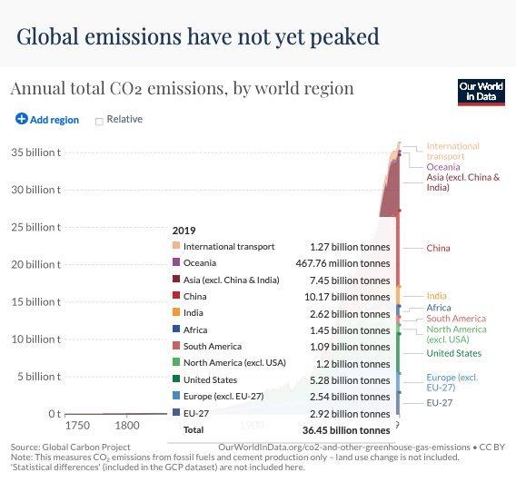

1. I downloaded CO2 emissions data from [Our World in Data](https://ourworldindata.org/). I selected this data because I'm interested in the highest contributors to CO2 omissions from 1900 through 2019.  

2. This is the [link](https://ourworldindata.org/co2-and-other-greenhouse-gas-emissions#global-emissions-have-not-yet-peaked) to the data.


3. The following code chunk loads the package I will use to read in and prepare the data for analysis

```{r}
library(tidyverse)

```

4. Read the data in  

```{r}
annual_co_emissions_by_region <- read_csv(here::here("_posts/2021-10-17-project-part-1/annual-co-emissions-by-region.csv"))

```

5. Use glimpse to see the names and types of the columns

```{r}
glimpse(annual_co_emissions_by_region)
View(annual_co_emissions_by_region)

```


6. Use output from glimpse (and View) to prepare the data for analysis


- Create the object `regions` that is list of regions I want to extract from the data set

- Change the name of 1st column to Region and the 4th column to CO2emissions

- Use filter to extract the rows that I want to keep: Year >= 1900 and Region in regions

- Select the columns to keep: Region, Year, CO2emissions 

- Use mutate to convert CO2emissions to billions of tonnes

- Assign the output to regional_co2

- Display the first 10 rows of regional_co2

```{r}
regions  <- c( "International transport",
               "Oceania",
               "Asia (excl. China & India)",
               "China",
               "India",
               "Africa",
               "South America",
               "North America (excl. USA)",
               "United States",
               "Europe (excl. EU-27)",
               "EU-27" )

regional_co2  <- annual_co_emissions_by_region  %>% 
  rename(Region = 1, CO2emissions = 4)  %>% 
  filter(Year >= 1900, Region %in%  regions)  %>% 
  select(Region, Year, CO2emissions)  %>% 
  mutate(CO2emissions = CO2emissions * 1e-9)

regional_co2
  
```

Check that the total for 2019 equals the total in the graph

```{r}

regional_co2  %>% filter(Year == 2019)  %>% 
  summarise(total_emm = sum(CO2emissions))

```


Add a picture.  

See how to change the width in the [R Markdown Cookbook](https://bookdown.org/yihui/rmarkdown-cookbook/text-width.html)

{width=100%}


Write the data to file in the project directory


```{r}
write_csv(regional_co2, file="regional_co2.csv")
```

